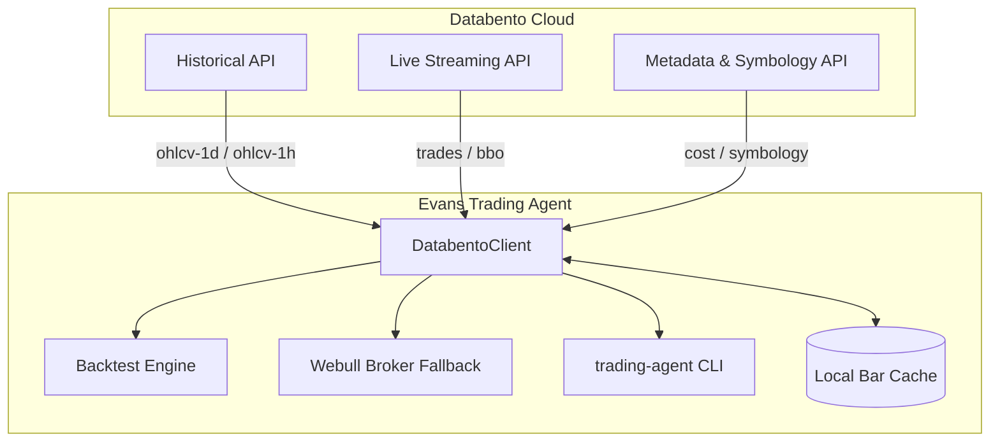

# Databento Market Data Integration Guide

This guide details how **Evan's Trading Agent** integrates with [Databento](https://databento.com/docs/quickstart/build-first-app?historical=python&live=python&reference=python) to provide institutional-grade historical market data, ultra-low-latency live streaming, symbology resolution, and pre-query cost safety controls.

---

## 1. Architecture Overview

Databento provides high-fidelity, raw and normalized market data from direct exchange feeds (CME, Nasdaq, NYSE, OPRA, etc.). Evan's Trading Agent wraps Databento in [`src/trading_agent/databento_data.py`](file:///Users/evanyap7/trading-agent/src/trading_agent/databento_data.py) with three core pillars:



1. **Historical (`db.Historical`)**:
   - Split- and dividend-adjusted daily and intraday OHLCV bars (`ohlcv-1d`, `ohlcv-1h`, `ohlcv-1m`).
   - Automatically converted into standard [`Bar`](file:///Users/evanyap7/trading-agent/src/trading_agent/schemas.py) models.
   - Normalized to Eastern Time (`America/New_York`) at `16:00 ET` daily market close.
2. **Live Streaming (`db.Live`)**:
   - Sub-microsecond real-time quotes, trades, and order-book snapshots via WebSocket/TCP protocol.
   - Event-driven callback mechanism (`add_callback`) ready for continuous intraday execution.
3. **Reference & Metadata**:
   - Query pre-flight cost calculation (`estimate_cost`).
   - Ticker symbology translation (`resolve_symbology`) to exchange instrument IDs.
   - Available dataset and schema catalog discovery.

---

## 2. Configuration & Cost Guardrails

### Environment Variables
Configure Databento in your `.env` file (see [`.env.example`](file:///Users/evanyap7/trading-agent/.env.example)):

```bash
# Obtain from https://databento.com/portal/keys
DATABENTO_API_KEY=db-xxxxxxxxxxxxxxxxxxxxxxxxx

# Default historical dataset: EQUS.SUMMARY (US Equities OHLCV), XNAS.ITCH, GLBX.MDP3
DATABENTO_DATASET=EQUS.SUMMARY

# Safety limit in USD per query (prevents unintentional runaway API spend)
DATABENTO_COST_LIMIT_USD=1.00

# Set backtester data source: databento or yfinance (fallback)
DATA_SOURCE=databento
```

### Safety Cost Guardrail
Every query to Databento's Historical API first calculates the exact dollar cost with `client.metadata.get_cost(...)`. If the estimated cost exceeds `DATABENTO_COST_LIMIT_USD` (default $1.00 USD), the client raises a `ValueError` immediately without executing the data download:
```python
# Automatic abort if cost exceeds threshold
cost = client.estimate_cost(symbols, start, end)
if cost > self.cost_limit_usd:
    raise ValueError(f"Databento query cost (${cost:.4f}) exceeds limit (${self.cost_limit_usd})")
```

### Local Caching
To minimize API charges, `DatabentoClient.get_daily_bars` checks for cached JSON bars in `state/cache/` or a custom directory before querying remote servers. Repeated backtests for the same date window incur zero API charges.

---

## 3. CLI Tools

The trading agent CLI exposes dedicated subcommands for probing connectivity, calculating costs, and inspecting bars:

### 1. Probe Connection & List Datasets
Verifies API key validity and outputs accessible market data feeds:
```bash
uv run trading-agent databento probe
```

### 2. Check Cost Before Downloading
Preview query costs across multiple tickers and date ranges:
```bash
uv run trading-agent databento cost --symbols SPY,QQQ,AAPL --start 2025-01-01 --end 2025-03-31
```
*Output:*
```text
Estimating cost for ['SPY', 'QQQ', 'AAPL'] from 2025-01-01 to 2025-03-31...
Estimated cost: $0.0042 USD
Safety cost limit: $1.00 USD
```

### 3. Fetch & Print Recent Bars
Fetches historical bars and prints the latest OHLCV sample:
```bash
uv run trading-agent databento bars --symbols SPY --days 10
```

---

## 4. Python API Usage

### Historical Daily Bars
```python
from datetime import date
from trading_agent.databento_data import DatabentoClient

client = DatabentoClient()

# Fetch daily bars for SPY and QQQ
bars = client.get_daily_bars(
    symbols=["SPY", "QQQ"],
    start=date(2025, 1, 1),
    end=date(2025, 2, 1),
)

for b in bars["SPY"][:5]:
    print(b.ts, b.open, b.high, b.low, b.close, b.volume)
```

### Live Market Stream
```python
from trading_agent.databento_data import DatabentoClient

client = DatabentoClient()

def on_trade_record(record):
    print(f"Trade event: {record}")

# Connect to live stream for intraday monitoring
live_stream = client.start_live_stream(
    symbols=["SPY", "QQQ"],
    callback=on_trade_record,
    schema="trades",
    dataset="EQUS.MINI",
)

# Terminate when session concludes:
# live_stream.stop()
```

### Symbology Resolution
```python
from datetime import date
from trading_agent.databento_data import DatabentoClient

client = DatabentoClient()

mapping = client.resolve_symbology(
    symbols=["SPY", "NVDA"],
    start_date=date(2025, 1, 1),
    end_date=date(2025, 1, 10),
)
print("Resolved symbology:", mapping)
```

---

## 5. Backtester & Broker Integration

- **Backtester**: Set `DATA_SOURCE=databento` or pass `--data-source databento` to `trading-agent backtest`. If `DATABENTO_API_KEY` is not present, it logs a warning and seamlessly falls back to `yfinance`.
- **Webull Broker**: In [`src/trading_agent/broker/webull.py`](file:///Users/evanyap7/trading-agent/src/trading_agent/broker/webull.py), `get_daily_bars` checks `DatabentoClient.is_available` first to retrieve clean institutional data, providing resilience if the primary broker data gateway is unavailable.
